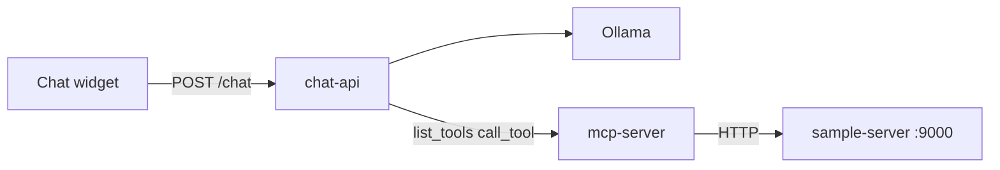

# MCP Chat Template

Embeddable chat widget + **Ollama (Llama)** host + **MCP** tool server. Fork this template to add AI chat with custom tools on any website.

**Full documentation:** [docs/GUIDE.md](docs/GUIDE.md)

## What you get

| Folder | Required? | Role |
|--------|-------------|------|
| [mcp-server/](mcp-server/) | Yes | MCP tools (e.g. call your APIs) |
| [chat-api/](chat-api/) | Yes | Ollama + MCP client — **only URL the widget calls** |
| [widget/](widget/) | Yes (build) | `chat-widget.js` embed script |
| [web/](web/) | No | Demo HTML page |
| [sample-server/](sample-server/) | For employee demo | Mock REST API behind the sample `list_employees` tool |

The sample server does **not** start with Ollama or Node by itself. For the employee list demo, something must serve `http://127.0.0.1:9000` — use `pnpm dev` (recommended) or run `pnpm dev:sample` in its own terminal.

## Architecture



**Llama decides** whether to reply in text or call a tool. The MCP server runs tools; it does not run the LLM.

---

## Run the full demo (step by step)

### Prerequisites

- **Node.js 20+** and **pnpm**
- **[Ollama](https://ollama.com)** installed and running (menu bar app on macOS, or `ollama serve`)
- Ports free: **8787** (chat-api), **8788** (mcp-server), **9000** (sample-server), **5174** (demo web), **11434** (Ollama)

### One-time setup

```bash
cp .env.example .env
pnpm install
pnpm setup:ollama    # downloads llama3.1 (matches OLLAMA_MODEL in .env)
pnpm build
```

Verify Ollama:

```bash
curl -s http://127.0.0.1:11434/api/tags
```

### Every time you work on the project

**Option A — one command (recommended)**

Starts MCP server, chat-api, **sample-server**, and the demo web page:

```bash
pnpm dev
```

Wait until you see logs for all four processes (mcp, api, sample, web). Then open:

**http://localhost:5174**

Try: *“Hi”* (no tool) and *“List employees”* (uses `list_employees` → sample API).

**Option B — separate terminals**

Useful if you prefer separate logs or only need part of the stack:

| Terminal | Command | URL |
|----------|---------|-----|
| 1 | `pnpm dev:sample` | http://127.0.0.1:9000/employees/list |
| 2 | `pnpm dev:mcp` | http://127.0.0.1:8788/mcp |
| 3 | `pnpm dev:api` | http://127.0.0.1:8787 |
| 4 | `pnpm dev:web` | http://localhost:5174 |
| — | Ollama app or `ollama serve` | http://127.0.0.1:11434 |

Start **sample-server before or with** chat-api if you will ask about employees.

### Sanity checks

```bash
# Sample employee API (must return JSON with employees)
curl -s http://127.0.0.1:9000/health
curl -s http://127.0.0.1:9000/employees/list | head

# Chat API + MCP + Ollama
curl -s http://127.0.0.1:8787/health | jq

# Chat without UI
curl -s -X POST http://127.0.0.1:8787/chat \
  -H 'Content-Type: application/json' \
  -d '{"message":"list employees"}' | jq
```

A healthy employee reply includes names from the sample API (e.g. **Alex Chen**, **Jordan Lee**) — not generic placeholders.

### Stop everything

Press **Ctrl+C** in the terminal running `pnpm dev`, or stop each `dev:*` terminal.

---

## Quickstart (short)

```bash
cp .env.example .env
pnpm install
pnpm setup:ollama
pnpm build
pnpm dev          # mcp + chat-api + sample-server + demo web
```

Open http://localhost:5174. Ollama must be running separately (it is not started by `pnpm dev`).

## Embed on your site

```html
<script
  src="https://YOUR_SERVER/chat-widget.js"
  data-api-url="https://YOUR_SERVER"
  data-title="Support Chat"
  defer
></script>
<div id="mcp-chat"></div>
```

Set `CORS_ORIGINS` on chat-api for your site's origin. See [docs/GUIDE.md § Embed](docs/GUIDE.md#6-the-micro-frontend-widget).

## Scripts

| Command | Starts |
|---------|--------|
| `pnpm dev` | mcp-server + chat-api + **sample-server** + web demo |
| `pnpm dev:all` | Same as `pnpm dev` |
| `pnpm dev:mcp` | MCP server only (`:8788`) |
| `pnpm dev:api` | chat-api only (`:8787`) |
| `pnpm dev:sample` | sample-server only (`:9000`) — **required for employee tool** |
| `pnpm dev:web` | static demo page (`:5174`) |
| `pnpm build` | compile all packages + widget |
| `pnpm setup:ollama` | pull Ollama model |

## Environment

Copy [.env.example](.env.example) → `.env`. Key variables:

| Variable | Service |
|----------|---------|
| `MCP_SERVER_URL` | chat-api → mcp-server |
| `CHAT_API_PORT` | chat-api (default 8787) |
| `OLLAMA_BASE_URL`, `OLLAMA_MODEL` | chat-api |
| `CORS_ORIGINS` | chat-api |
| `SAMPLE_API_URL` | mcp-server → sample-server (default `http://127.0.0.1:9000`) |
| `SAMPLE_PORT` | sample-server listen port (default 9000) |

## Troubleshooting

| Problem | Fix |
|---------|-----|
| “Could not load employee directory” / tool error | Start sample-server: `pnpm dev:sample` or use `pnpm dev` |
| Wrong or fake employee names | Restart chat-api after code changes; ensure sample-server is up (`curl :9000/employees/list`) |
| MCP not ready / cannot connect | Run `pnpm dev` or `pnpm dev:mcp` first; ensure port **8788** is free |
| CORS error in browser | Add your origin to `CORS_ORIGINS` in `.env` |
| Ollama errors | Open Ollama app or `ollama serve`; run `pnpm setup:ollama` |
| Empty or 500 from `/chat` | Check `curl :8787/health` — needs Ollama + MCP |

More: [docs/GUIDE.md § Troubleshooting](docs/GUIDE.md#13-troubleshooting)

## License

MIT — see [LICENSE](LICENSE)
