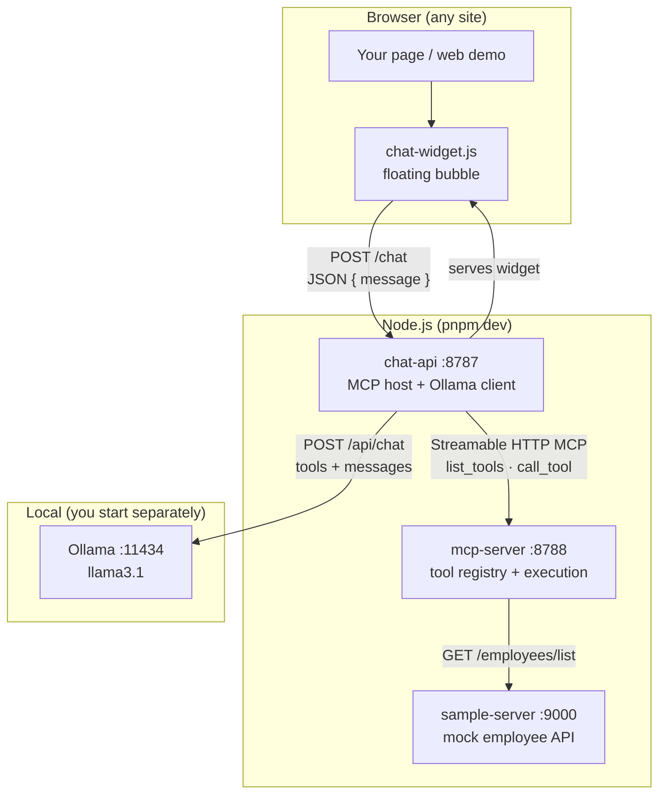
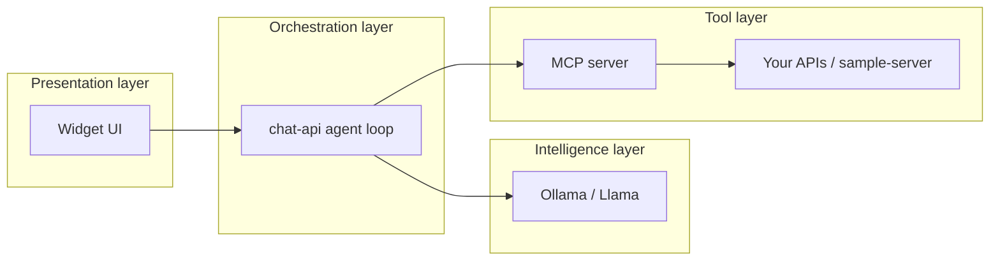
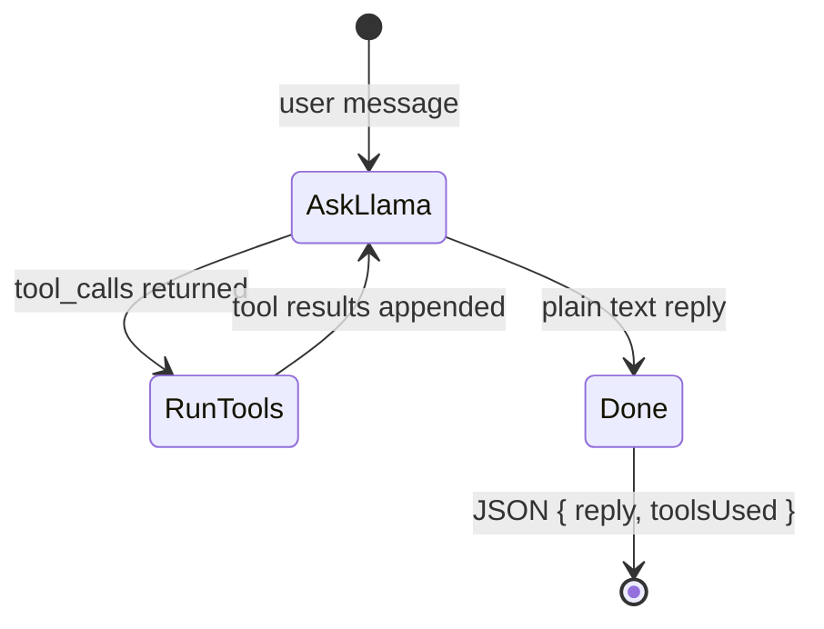
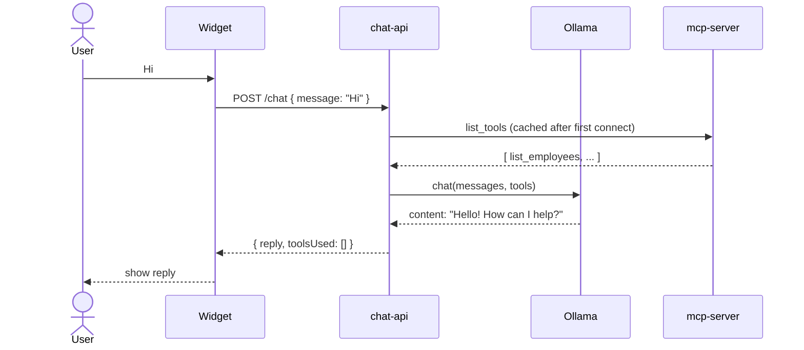
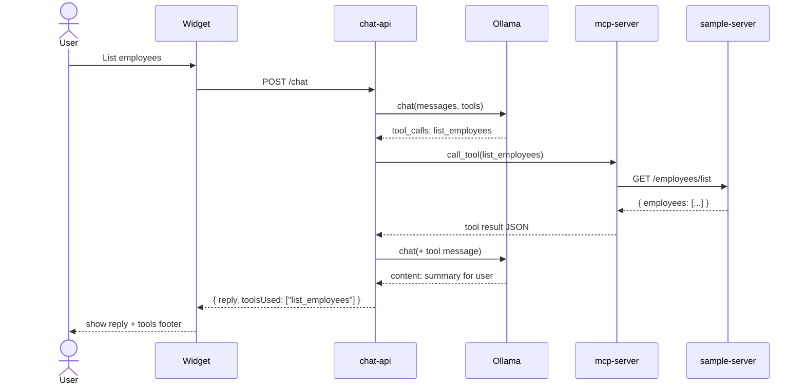

# MCP Chat Template

A production-style template for adding **AI chat with tools** to any website. It combines:

- An **embeddable micro-frontend** (floating chat bubble, bottom-right)
- A **chat API** that hosts the LLM conversation (Ollama / Llama)
- An **MCP server** that exposes tools your model can call
- An optional **sample REST API** for the included `list_employees` demo

Fork this repo to wire in your own APIs, databases, or internal services via MCP tools, while keeping the widget and agent loop unchanged.

**Extended guide:** [docs/GUIDE.md](docs/GUIDE.md) (extending tools, CORS, deployment, API reference).

---

## Table of contents

- [What you get](#what-you-get)
- [Architecture](#architecture)
- [How a message flows](#how-a-message-flows)
- [Run the full demo](#run-the-full-demo)
- [Embed on your site](#embed-on-your-site)
- [Scripts](#scripts)
- [Environment variables](#environment-variables)
- [Troubleshooting](#troubleshooting)
- [License](#license)

---

## What you get

| Package | Folder | Required? | Role |
|---------|--------|-----------|------|
| **Widget** | [widget/](widget/) | Yes (build) | `chat-widget.js` — floating bubble UI, talks only to chat-api |
| **Chat API (MCP host)** | [chat-api/](chat-api/) | Yes | Agent loop: Ollama + MCP client; exposes `POST /chat` |
| **MCP server** | [mcp-server/](mcp-server/) | Yes | Registers and runs tools (e.g. HTTP calls to your APIs) |
| **Web demo** | [web/](web/) | No | Sample HTML page (“Welcome to sample page”) |
| **Sample API** | [sample-server/](sample-server/) | For employee demo | Mock `GET /employees/list` behind `list_employees` |
| **Ollama** | External | Yes | Local LLM on `:11434` — **not** started by `pnpm dev` |

### Design principles

1. **The widget never talks to MCP or Ollama directly** — only to `chat-api`. One origin to configure for CORS and TLS.
2. **Llama decides** each turn: plain text reply, or `tool_calls`. The host does not pre-route “Hi” vs “employees” with hardcoded answers.
3. **MCP runs tools only** — no LLM inside the MCP server. That matches the [Model Context Protocol](https://modelcontextprotocol.io) model.
4. **Tools call your backends** — the sample uses `sample-server`; you replace that with real services.

---

## Architecture

### System context

Your website (or the local demo page) loads a small script. The user chats in the bubble; every message becomes one HTTP request to the chat API. The API runs an agent loop against Ollama and, when needed, the MCP server.



### Ports and URLs

| Port | Service | URL / endpoint | Who calls it |
|------|---------|----------------|--------------|
| **5174** | Web demo (static) | http://localhost:5174 | You (browser) |
| **8787** | chat-api | `POST /chat`, `GET /health`, `/chat-widget.js` | Widget, curl |
| **8788** | mcp-server | http://127.0.0.1:8788/mcp | chat-api only |
| **9000** | sample-server | `GET /employees/list`, `GET /health` | mcp-server tool |
| **11434** | Ollama | `POST /api/chat`, `GET /api/tags` | chat-api only |

### Logical layers



| Layer | Responsibility |
|-------|----------------|
| **Widget** | Render bubble + panel; send user text; show `reply` and optional `toolsUsed` |
| **chat-api** | Load MCP tool schemas; call Ollama with tools; execute `tool_calls`; return final text |
| **Ollama** | Natural language, when to call tools, summarizing tool results |
| **mcp-server** | Tool definitions (name, description, Zod schema) and handlers |
| **Backends** | Real data (sample employee list in the template) |

### MCP host agent loop (chat-api)

This is the core of `chat-api/agent.ts`:



On each round:

1. Send **system + user (+ prior tool messages)** to Ollama with the MCP tool list.
2. If Ollama returns **`tool_calls`** for known tools → `call_tool` on MCP → append `{ role: tool, tool_name, content }` → loop.
3. If Ollama returns **text** → return that as `reply` to the widget.
4. Invalid empty or tool-shaped JSON in `content` triggers a **retry** in the same thread (still Llama, not canned user text).

### Sequence: greeting (“Hi”)

No MCP tool runs unless Llama chooses to call one (usually it does not for a greeting).



### Sequence: employee list

Llama should call `list_employees`; MCP fetches the sample API; Llama summarizes the JSON.



### Repository layout

```text
mcp/
├── widget/           # Vite IIFE → chat-widget.js + widget.css
├── chat-api/         # Express, agent loop, serves built widget
├── mcp-server/       # MCP SDK, tools/sample-employees.ts
├── sample-server/    # Express mock API
├── web/              # Demo index.html
├── docs/GUIDE.md     # Full documentation
├── scripts/          # setup-ollama.sh
└── .env              # Ports, Ollama model, CORS, SAMPLE_API_URL
```

---

## How a message flows

1. User types in the widget and submits.
2. Widget `POST`s to `{apiUrl}/chat` with `{ "message": "..." }`.
3. **chat-api** connects to **mcp-server** (on startup, with retries), loads tool definitions, and starts the agent loop with **Ollama**.
4. **Ollama** either answers in text or requests tools.
5. For each tool call, **chat-api** invokes **mcp-server**, which may call **your HTTP API** (template: sample-server).
6. Tool output goes back to **Ollama** until a final natural-language `reply` is produced.
7. Widget displays `reply` and, if present, `toolsUsed` (e.g. `Tools: list_employees`).

**Important:** `pnpm dev` starts Node services but **not** Ollama. Start the [Ollama](https://ollama.com) app (or `ollama serve`) before chatting.

---

## Run the full demo

### Prerequisites

- **Node.js 20+** and **pnpm**
- **[Ollama](https://ollama.com)** running (`curl -s http://127.0.0.1:11434/api/tags` should succeed)
- Free ports: **8787**, **8788**, **9000**, **5174**, **11434**

### One-time setup

```bash
cp .env.example .env
pnpm install
pnpm setup:ollama    # ollama pull llama3.1 (matches OLLAMA_MODEL)
pnpm build
```

### Every session

**Recommended — one command**

```bash
pnpm dev
```

Starts **mcp-server**, **chat-api**, **sample-server**, and **web** together. Wait for four log prefixes: `[mcp]`, `[api]`, `[sample]`, `[web]`.

Open **http://localhost:5174** — you should see “Welcome to sample page” and a **chat bubble** bottom-right.

Try:

- *“Hi”* — Llama replies in text (no tool required).
- *“List employees”* — should call `list_employees` and mention real names from the API (e.g. Alex Chen, Jordan Lee).

**Separate terminals** (optional)

| Terminal | Command | Purpose |
|----------|---------|---------|
| — | Ollama app / `ollama serve` | LLM |
| 1 | `pnpm dev:sample` | Employee API `:9000` |
| 2 | `pnpm dev:mcp` | MCP `:8788` |
| 3 | `pnpm dev:api` | Chat API `:8787` |
| 4 | `pnpm dev:web` | Demo page `:5174` |

### Sanity checks

```bash
# Ollama
curl -s http://127.0.0.1:11434/api/tags

# Sample API (required for employee tool)
curl -s http://127.0.0.1:9000/health
curl -s http://127.0.0.1:9000/employees/list | head

# Chat API stack
curl -s http://127.0.0.1:8787/health | jq

# Chat without UI
curl -s -X POST http://127.0.0.1:8787/chat \
  -H 'Content-Type: application/json' \
  -d '{"message":"list employees"}' | jq
```

### Stop

`Ctrl+C` in the `pnpm dev` terminal. If port **9000** is stuck (`EADDRINUSE`), kill the old process:

```bash
lsof -i :9000
kill <PID>
```

---

## Embed on your site

After `pnpm build`, host `chat-widget.js` (and CSS) from **chat-api** or your CDN.

```html
<script
  src="https://YOUR_CHAT_API/chat-widget.js"
  data-api-url="https://YOUR_CHAT_API"
  data-title="Support"
  defer
></script>
```

- No container `div` required — the script appends a **fixed bottom-right bubble** to `document.body`.
- Optional: `data-container="my-div"` to mount inside a specific element.

Set `CORS_ORIGINS` in `.env` to your site’s origin(s). Details: [docs/GUIDE.md § Widget](docs/GUIDE.md#6-the-micro-frontend-widget).

### Extending with your own tools

1. Copy [mcp-server/tools/sample-employees.ts](mcp-server/tools/sample-employees.ts).
2. Register in [mcp-server/tools/index.ts](mcp-server/tools/index.ts).
3. Restart **mcp-server** — chat-api picks up new tools on the next `list_tools`.

No widget changes needed; Llama sees new tools automatically.

---

## Scripts

| Command | Description |
|---------|-------------|
| `pnpm dev` | mcp-server + chat-api + sample-server + web demo |
| `pnpm dev:all` | Same as `pnpm dev` |
| `pnpm dev:mcp` | MCP server only (`:8788`) |
| `pnpm dev:api` | chat-api only (`:8787`) |
| `pnpm dev:sample` | sample-server only (`:9000`) |
| `pnpm dev:web` | Demo static site (`:5174`) |
| `pnpm build` | Build all packages + widget |
| `pnpm setup:ollama` | Pull `llama3.1` (or your `OLLAMA_MODEL`) |

---

## Environment variables

Copy [.env.example](.env.example) to `.env`.

| Variable | Used by | Default | Purpose |
|----------|---------|---------|---------|
| `CHAT_API_PORT` | chat-api | `8787` | Widget `apiUrl` port |
| `MCP_PORT` | mcp-server | `8788` | MCP HTTP port |
| `MCP_SERVER_URL` | chat-api | `http://127.0.0.1:8788/mcp` | MCP endpoint |
| `OLLAMA_BASE_URL` | chat-api | `http://127.0.0.1:11434` | Ollama API |
| `OLLAMA_MODEL` | chat-api | `llama3.1` | Model id for `/api/chat` |
| `CORS_ORIGINS` | chat-api | `*` or localhost list | Allowed browser origins |
| `SAMPLE_PORT` | sample-server | `9000` | Mock API port |
| `SAMPLE_API_URL` | mcp-server tool | `http://127.0.0.1:9000` | Base URL for `list_employees` |

---

## Troubleshooting

| Symptom | Likely cause | Fix |
|---------|----------------|-----|
| `EADDRINUSE` port 9000 | Old sample-server still running | `lsof -i :9000` → `kill <PID>` → `pnpm dev` |
| Employee tool fails / empty data | sample-server not running | Use `pnpm dev` or `pnpm dev:sample` |
| `Cannot connect to MCP` | mcp-server down or port 8788 busy | `pnpm dev:mcp` or full `pnpm dev` |
| Ollama / 500 on `/chat` | Ollama not running or model missing | Open Ollama app; `pnpm setup:ollama` |
| CORS error in browser | Origin not allowed | Add site to `CORS_ORIGINS` |
| MCP not ready on api start | MCP slower than api | chat-api retries; wait or start mcp first |
| Raw JSON in chat bubble | Model put tool JSON in `content` | Restart chat-api; agent retries via Llama |
| Wrong employee names | Model hallucination or stale API | `curl :9000/employees/list`; trust tool JSON |

More detail: [docs/GUIDE.md § Troubleshooting](docs/GUIDE.md#13-troubleshooting)

---

## License

MIT — see [LICENSE](LICENSE)
